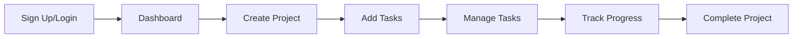

# 🚀 TeamCollab - Modern Project Management Platform

<div align="center">


[](https://opensource.org/licenses/MIT)
[](https://nodejs.org)
[](https://reactjs.org)
[](https://www.mongodb.com)

A beautiful, modern, and feature-rich project management platform with real-time collaboration, AI-powered task suggestions, and an intuitive drag-and-drop interface.

### 🌐 **[LIVE DEMO](https://teamcollab-alpha.vercel.app)** 🌐

[](https://teamcollab-alpha.vercel.app)
[](https://teamcollab-1-gbpq.onrender.com/api/test)

**Frontend:** [https://teamcollab-alpha.vercel.app](https://teamcollab-alpha.vercel.app)  
**Backend API:** [https://teamcollab-1-gbpq.onrender.com](https://teamcollab-1-gbpq.onrender.com)

[Features](#-features) • [Demo](#-demo) • [Installation](#-installation) • [Usage](#-usage) • [API](#-api-documentation) • [Contributing](#-contributing)

</div>

---

## ✨ Features

### 🎨 **Modern & Interactive UI**
- **Glassmorphism Design**: Beautiful glass-morphic cards with backdrop blur effects
- **Dark Theme**: Stunning gradient backgrounds with purple and blue tones
- **Smooth Animations**: Framer Motion animations for delightful user interactions
- **Responsive Design**: Works perfectly on desktop, tablet, and mobile devices

### 📊 **Project Management**
- **Project Dashboard**: Create, view, and manage multiple projects
- **Task Organization**: Kanban board with drag-and-drop functionality
- **Real-time Updates**: Socket.IO integration for instant collaboration
- **Task Statistics**: Visual stats showing project progress and task distribution

### 🤖 **AI-Powered Features**
- **AI Task Suggestions**: Get intelligent task recommendations based on project details
- **Smart Workflows**: AI helps break down projects into actionable tasks

### 🔐 **Authentication & Security**
- **JWT Authentication**: Secure token-based authentication
- **Password Encryption**: bcrypt for secure password hashing
- **Protected Routes**: Middleware-based route protection
- **Session Management**: Persistent login with localStorage

### 🎯 **Task Management**
- **Drag & Drop**: Intuitive task movement between columns (To Do, In Progress, Done)
- **Task Details**: Title, description, due date, and assignee
- **Task Filtering**: Automatic sorting by due date
- **Quick Actions**: Edit and delete tasks with confirmation

### 🌐 **Real-time Collaboration**
- **Live Updates**: See changes instantly across all connected clients
- **Socket.IO**: WebSocket-based real-time communication
- **Multi-user Support**: Multiple team members can work simultaneously

---

## 🎥 Demo

### Dashboard View


### Task Board View


### Mobile Responsive


---

## 🛠️ Tech Stack

### Frontend
- **React 19** - Modern UI library
- **Vite** - Next generation frontend tooling
- **Tailwind CSS 4** - Utility-first CSS framework
- **Framer Motion** - Animation library
- **React Router DOM** - Client-side routing
- **Formik & Yup** - Form handling and validation
- **Axios** - HTTP client
- **React Beautiful DnD** - Drag and drop
- **Heroicons** - Beautiful icon set
- **Socket.IO Client** - Real-time updates

### Backend
- **Node.js** - JavaScript runtime
- **Express 5** - Web framework
- **MongoDB** - NoSQL database
- **Mongoose** - MongoDB object modeling
- **JWT** - JSON Web Tokens
- **bcryptjs** - Password hashing
- **Socket.IO** - WebSocket library
- **OpenAI/Cohere** - AI integrations
- **CORS** - Cross-origin resource sharing
- **dotenv** - Environment variables

---

## 📦 Installation

### Prerequisites
- Node.js 18+ installed
- MongoDB installed and running (or MongoDB Atlas account)
- npm or yarn package manager
- Git

### Clone the Repository
```bash
git clone https://github.com/yourusername/teamcollab.git
cd teamcollab
```

### Backend Setup

1. Navigate to the server directory:
```bash
cd teamcollab-server
```

2. Install dependencies:
```bash
npm install
```

3. Create a `.env` file in the `teamcollab-server` directory:
```env
PORT=5000
MONGODB_URI=mongodb://localhost:27017/teamcollab
JWT_SECRET=your_super_secret_jwt_key_here_change_this
NODE_ENV=development

# Optional: AI API Keys (for task suggestions)
OPENAI_API_KEY=your_openai_key_here
COHERE_API_KEY=your_cohere_key_here
```

4. Start the server:
```bash
# Development mode with auto-reload
npm run dev

# Production mode
npm start
```

The server will run on `http://localhost:5000`

### Frontend Setup

1. Open a new terminal and navigate to the client directory:
```bash
cd teamcollab-client
```

2. Install dependencies:
```bash
npm install
```

3. Create a `.env` file in the `teamcollab-client` directory (optional):
```env
VITE_API_BASE_URL=http://localhost:5000/api
```

4. Start the development server:
```bash
npm run dev
```

The app will run on `http://localhost:5173`

### Building for Production

#### Frontend
```bash
cd teamcollab-client
npm run build
npm run preview  # Preview the production build
```

#### Backend
```bash
cd teamcollab-server
npm start
```

---

## 🚀 Usage

### Creating Your First Project

1. **Sign Up**: Create a new account at the signup page
2. **Login**: Access your dashboard
3. **Create Project**: Click "New Project" and fill in the details
4. **Add Tasks**: Navigate to a project and start adding tasks
5. **AI Suggestions**: Use the "AI Suggest Tasks" button for intelligent recommendations
6. **Drag & Drop**: Move tasks between columns as work progresses
7. **Collaborate**: Share with team members for real-time updates

### User Workflow



---

## 📚 API Documentation

### Authentication Endpoints

#### Register User
```http
POST /api/auth/signup
Content-Type: application/json

{
  "name": "John Doe",
  "email": "john@example.com",
  "password": "password123"
}
```

#### Login User
```http
POST /api/auth/login
Content-Type: application/json

{
  "email": "john@example.com",
  "password": "password123"
}
```

### Project Endpoints

#### Get All Projects
```http
GET /api/projects
Authorization: Bearer {token}
```

#### Create Project
```http
POST /api/projects
Authorization: Bearer {token}
Content-Type: application/json

{
  "name": "My Project",
  "description": "Project description"
}
```

#### Delete Project
```http
DELETE /api/projects/:id
Authorization: Bearer {token}
```

### Task Endpoints

#### Get Project Tasks
```http
GET /api/tasks/:projectId
Authorization: Bearer {token}
```

#### Create Task
```http
POST /api/tasks
Authorization: Bearer {token}
Content-Type: application/json

{
  "title": "Task Title",
  "description": "Task description",
  "status": "todo",
  "dueDate": "2026-01-15",
  "assignedTo": "John",
  "project": "project_id"
}
```

#### Update Task
```http
PUT /api/tasks/:id
Authorization: Bearer {token}
Content-Type: application/json

{
  "title": "Updated Title",
  "status": "inprogress"
}
```

#### Delete Task
```http
DELETE /api/tasks/:id
Authorization: Bearer {token}
```

### AI Endpoints

#### Get Task Suggestions
```http
POST /api/suggest-tasks
Content-Type: application/json

{
  "projectTitle": "E-commerce Website",
  "description": "Build a modern e-commerce platform"
}
```

---

## 🏗️ Project Structure

```
teamcollab/
├── teamcollab-client/           # Frontend React application
│   ├── public/                  # Static assets
│   ├── src/
│   │   ├── assets/             # Images, fonts, etc.
│   │   ├── components/         # React components
│   │   │   └── Auth/           # Authentication components
│   │   │       ├── Login.jsx
│   │   │       └── Signup.jsx
│   │   ├── pages/              # Page components
│   │   │   ├── Dashboard.jsx
│   │   │   └── TasksPage.jsx
│   │   ├── services/           # API services
│   │   │   ├── api.js          # Axios instance
│   │   │   └── ai.js           # AI service
│   │   ├── App.jsx             # Main App component
│   │   ├── main.jsx            # Entry point
│   │   └── index.css           # Global styles
│   ├── package.json
│   ├── vite.config.js
│   └── tailwind.config.js
│
├── teamcollab-server/           # Backend Node.js application
│   ├── middleware/
│   │   └── authMiddleware.js   # JWT verification
│   ├── models/                 # Mongoose models
│   │   ├── User.js
│   │   ├── Project.js
│   │   └── Task.js
│   ├── routes/                 # Express routes
│   │   ├── auth.js             # Authentication routes
│   │   ├── projects.js         # Project routes
│   │   ├── tasks.js            # Task routes
│   │   ├── ai.js               # AI routes
│   │   └── test.js             # Test routes
│   ├── db.js                   # MongoDB connection
│   ├── index.js                # Server entry point
│   └── package.json
│
├── .gitignore
├── LICENSE
├── README.md
└── package.json                # Root package.json
```

---

## 🔧 Configuration

### Environment Variables

#### Server (.env)
```env
PORT=5000                                    # Server port
MONGODB_URI=mongodb://localhost:27017/teamcollab  # MongoDB connection
JWT_SECRET=your_secret_key                   # JWT secret
NODE_ENV=development                         # Environment
OPENAI_API_KEY=your_key                      # Optional: OpenAI API
COHERE_API_KEY=your_key                      # Optional: Cohere API
```

#### Client (.env)
```env
VITE_API_BASE_URL=http://localhost:5000/api  # API base URL
```

---

## 🧪 Testing

```bash
# Run tests (if configured)
npm test

# Run with coverage
npm run test:coverage
```

---

## 🤝 Contributing

We welcome contributions! Please see [CONTRIBUTING.md](CONTRIBUTING.md) for details.

### Development Workflow

1. Fork the repository
2. Create a feature branch (`git checkout -b feature/AmazingFeature`)
3. Commit your changes (`git commit -m 'Add some AmazingFeature'`)
4. Push to the branch (`git push origin feature/AmazingFeature`)
5. Open a Pull Request

### Code Style

- Use ESLint for linting
- Follow React best practices
- Write meaningful commit messages
- Add comments for complex logic

---

## 📝 License

This project is licensed under the MIT License - see the [LICENSE](LICENSE) file for details.

---

## 👥 Authors

- **Your Name** - *Initial work* - [YourGitHub](https://github.com/yourusername)

---

## 🙏 Acknowledgments

- [React](https://reactjs.org/) - The web framework used
- [Tailwind CSS](https://tailwindcss.com/) - CSS framework
- [Framer Motion](https://www.framer.com/motion/) - Animation library
- [Heroicons](https://heroicons.com/) - Icon set
- [MongoDB](https://www.mongodb.com/) - Database
- [OpenAI](https://openai.com/) - AI capabilities

---

## 📞 Support

For support, email your-email@example.com or join our Slack channel.

---

## 🗺️ Roadmap

- [ ] Email notifications
- [ ] File attachments
- [ ] Team management
- [ ] Calendar view
- [ ] Time tracking
- [ ] Dark/Light mode toggle
- [ ] Export to PDF
- [ ] Mobile app
- [ ] Integration with GitHub/GitLab
- [ ] Advanced analytics

---

## ⭐ Star History

If you like this project, please give it a ⭐ on GitHub!

---

<div align="center">

Made with ❤️ by the TeamCollab Team

[Back to Top](#-teamcollab---modern-project-management-platform)

</div>
